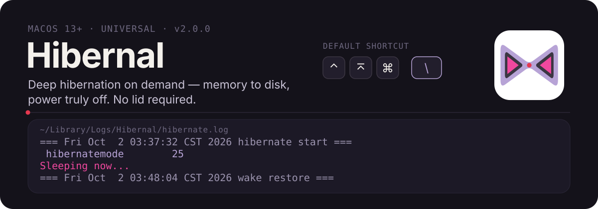
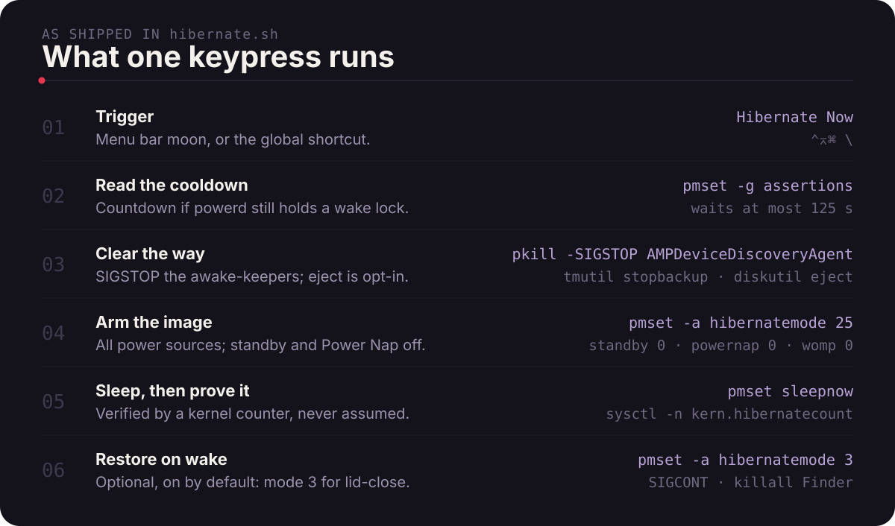
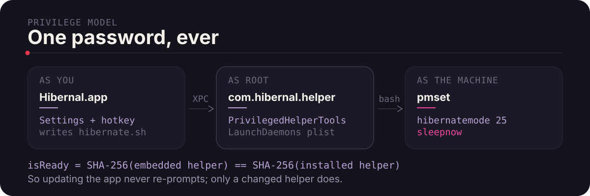

# Hibernal

<p align="center">
  
</p>

<p align="center">
  English &middot; <a href="README.zh-CN.md">简体中文</a>
</p>

A MacBook will not hibernate just because you want it to. Closing the lid gives you sleep; long idle gives you standby. Hibernal adds the missing door: your Mac writes its memory image to disk and loses power, on demand, from a keystroke.

## The short version

- **`hibernatemode 25`, then `pmset sleepnow`** — the memory image goes to disk and RAM loses power, instead of a sleeping Mac slowly draining in a bag.
- **One keystroke, or one menu bar click.** Default shortcut `Control + Option + Command + \`, changeable in Settings.
- **Lid-close stays normal.** Optionally restores `hibernatemode 3` after wake, so the hinge keeps doing what it always did.
- **One password, ever.** A privileged helper does the work; it re-asks only when the helper itself changes.
- **It refuses to guess.** The run is verified against a kernel counter, and a hibernate that did not happen is logged as such.

## Proof it really hibernated

This is a verbatim block from `~/Library/Logs/Hibernal/hibernate.log` on an Apple Silicon Mac (M4):

```text
=== Fri Oct  2 03:37:32 CST 2026 hibernate start ===
Now drawing from 'AC Power'
 -InternalBattery-0 (id=7471203)	100%; charged; 0:00 remaining present: true
=== Fri Oct  2 03:37:32 CST 2026 ejecting external drives ===
Disk /dev/disk4 ejected
Disk /dev/disk5 ejected
 hibernatemode        25
 hibernatemode        25
Sleeping now...
=== Fri Oct  2 03:48:04 CST 2026 wake restore ===
=== Fri Oct  2 03:48:06 CST 2026 hibernate end ===
```

That block is self-attesting: `wake restore` only prints if `kern.hibernatecount` moved while the script was running — otherwise it exits early and logs `sleepnow did not hibernate`. The machine was asleep for ten and a half minutes and came back to the same session. Two commands tell the same story on your own Mac:

```bash
pmset -g log | grep -c "Wake from Hibernate"   # how many real hibernations were recovered
sysctl -n kern.hibernatecount                   # the counter Hibernal compares before and after
```

## What one keypress runs

<p align="center">
  
</p>

1. **Trigger** — the global hotkey, or **Hibernate Now** in the menu bar. A second request supersedes a pending one.
2. **Cooldown check** — `pmset -g assertions` is read first. If `hibernate user wake`, `acwakelinger` or `darkwakelinger` is listed, a small panel counts down instead of sleeping into a system that will refuse; the wait is capped at 125 s, 45 s and 10 s respectively.
3. **Clear the way** — sleep-blocking agents are paused with `SIGSTOP` (`AMPDeviceDiscoveryAgent`, `AMPSystemPlayerAgent`, and a running `grok-macos-aarch64`), and an in-flight Time Machine backup is stopped. External physical disks are ejected only if you switch that on; network volumes are never touched.
4. **Arm** — `hibernatemode 25` on all three power sources, plus `standby 0`, `autopoweroff 0`, `powernap 0`, `womp 0`.
5. **Sleep and verify** — `pmset sleepnow`, then `kern.hibernatecount` is read again. If it did not move, `hibernatemode` deliberately stays at 25 and the log records `sleepnow did not hibernate` rather than pretending the restore happened.
6. **Restore on wake** — with **Restore normal sleep** on (the default), `hibernatemode` goes back to `3` and `standby`, `autopoweroff`, `powernap` and `womp` go back to `1`. The paused Grok agent gets its `SIGCONT`, `AirPlayXPCHelper` is kickstarted, and Finder is relaunched.

## Who runs it, with which privilege

<p align="center">
  
</p>

The app itself never escalates. It writes the script to `~/Library/Application Support/Hibernal/hibernate.sh` and hands the path to `com.hibernal.helper`, which runs it as root in one launch. Readiness is a SHA-256 comparison between the helper embedded in the app and the helper installed on disk — which is why **upgrading Hibernal does not ask for your password again**, and why the prompt returns only when the helper genuinely changed.

If the helper is missing or refuses, the app falls back to a single `do shell script … with administrator privileges` prompt for that one run. Settings shows the state directly: a green dot on the helper line means hibernate will not ask you for anything; orange means the next hibernate will.

## Install

```bash
brew install --cask hibernalglow/tap/hibernal
```

Or grab `Hibernal-<version>.dmg` from [the latest release](https://github.com/HibernalGlow/hibernal/releases/latest), mount it, and drag **Hibernal** to **Applications**.

Builds are **ad-hoc signed and not notarized** — there is no Developer ID behind this project. The signature does validate (`codesign --verify --deep --strict` passes), so Finder will not call the app damaged, but a quarantined download still needs one manual approval: **System Settings → Privacy & Security → Open Anyway**. Homebrew sets the quarantine flag too, so that override applies once after each install or upgrade.

Then: press `Control + Option + Command + \`, type your password once to install the helper, and the Mac goes into hibernation. On a notched MacBook the moon may sit inside the menu bar `•••` overflow — the shortcut works either way.

Moving a copy into `/Applications` by hand? **Quit App** first, then toggle **Start on login** off and on once — the login item records an absolute path, and that toggle is what rewrites it.

## Settings

| Option | Default | What it does |
|--------|---------|--------------|
| **Enable hibernate** | on | Master switch for the shortcut and the hibernate actions |
| **Restore normal sleep (hibernatemode 3) after wake** | on | Returns the Mac to standard lid behaviour after a shortcut hibernate |
| **Eject external drives before hibernate** | off | Safely ejects USB, Thunderbolt and SD volumes; network volumes unaffected |
| **Keep awake on power adapter** | off | `pmset -c sleep 0` while plugged in; turning it off restores a 10-minute AC sleep timer |
| **Start on login** | on | Launches hidden into the menu bar |
| **Keyboard shortcut** | `⌃⌥⌘ \` | Rebound from **Change Shortcut…** |

**View pmset in Terminal** opens a generated `pmset-check.command` that prints `pmset -g`, `-g custom` and `-g assertions`, so you can see the exact state the app reads and writes.

Window and service controls: **Cmd+Q** or the red button hides Settings and keeps the menu bar alive; **Stop Background Service** disables the icon and shortcut; **Restart App** brings them back; **Quit App** exits for real.

## Limits worth knowing

- **A second hibernate right after waking is the fragile case.** Measured on an M-series Mac: after waking from hibernate, `powerd` holds a `hibernate user wake` assertion for **600 s**, and Hibernal waits at most **125 s** before forcing `pmset sleepnow` anyway. Inside that window a forced sleep has been observed both hibernating and not hibernating, so the countdown is not a guarantee. Check `pmset -g log` for `Wake from Hibernate` to see which you got — and if you did not, `hibernatemode` is still 25, so your next lid-close will hibernate.
- **Waking itself about ten minutes after hibernating is not this app.** On every sleep `powerd` schedules a user-invisible wake alarm ~590 s out, registered by `AppleCredentialManagerDaemon` (`com.apple.alarm.user-invisible-com.apple.acmd.alarm`). `pmset -g sched` does not show it while pending, `pmset schedule cancelall` does not remove it, and disabling AppleCredentialManager is not advisable — it is a system credential/TPM-facing daemon.
- **The shortcut can lag right after login.** It registers when the background service starts and re-registers on wake, on screen unlock, and when the app becomes active — so unlocking the screen or opening Settings once is what refreshes it.

## Where things live

| Path | What it is |
|------|------------|
| `~/Library/Logs/Hibernal/hibernate.log` | Every hibernate run, start to restore |
| `~/Library/Logs/Hibernal/power.log` | AC keep-awake changes |
| `~/Library/Application Support/Hibernal/` | `hibernate.sh`, `pmset-check.command`, `hibernate.lock` |
| `/Library/PrivilegedHelperTools/com.hibernal.helper` | The root helper (`com.hibernal.app`, login agent `com.hibernal.agent`) |
| `com.hibernal.settings` | The preferences domain behind the Settings window |

English and Simplified Chinese ship together; the app follows the system language, and `CFBundleLocalizations` lists both, so you can pin one language to this app alone in System Settings.

## Build from source

```bash
git clone https://github.com/HibernalGlow/hibernal.git
cd hibernal
./build-dmg.sh          # or ./build-app.sh for just the bundle
```

Requires macOS 13.0+, and Xcode command line tools for `swiftc` and `codesign`. Outputs are `dist/Hibernal.app` and `releases/Hibernal-<version>.dmg` (both gitignored; published assets come from CI).

`build-app.sh` compiles every arch in `ARCHS` (default `arm64 x86_64`), `lipo`s them into one universal binary, signs inside-out — helper first, then the bundle seal — and fails the build if `codesign --verify --deep --strict` rejects the result. Set `SIGN_IDENTITY="Developer ID Application: …"` to sign with a real certificate.

Pushing a `v*` tag runs `.github/workflows/release.yml`, which builds, verifies and publishes the DMG as a release asset and prints its sha256 in the job summary for the Homebrew cask.

## Renamed in 2.0.0

*Hibernate Control* became **Hibernal**, including the bundle id (`com.hibernal.app`), the helper (`com.hibernal.helper`), the login item (`com.hibernal.agent`) and the settings domain. A pre-2.0.0 copy keeps its old helper and login item installed; remove them once the new version works:

```bash
sudo launchctl bootout system/com.hibernatecontrol.helper
sudo rm /Library/LaunchDaemons/com.hibernatecontrol.helper.plist \
        /Library/PrivilegedHelperTools/com.hibernatecontrol.helper \
        ~/Library/LaunchAgents/com.hibernatecontrol.agent.plist
```

## License

Personal utility project. Use at your own risk — hibernation affects power state and open work.
